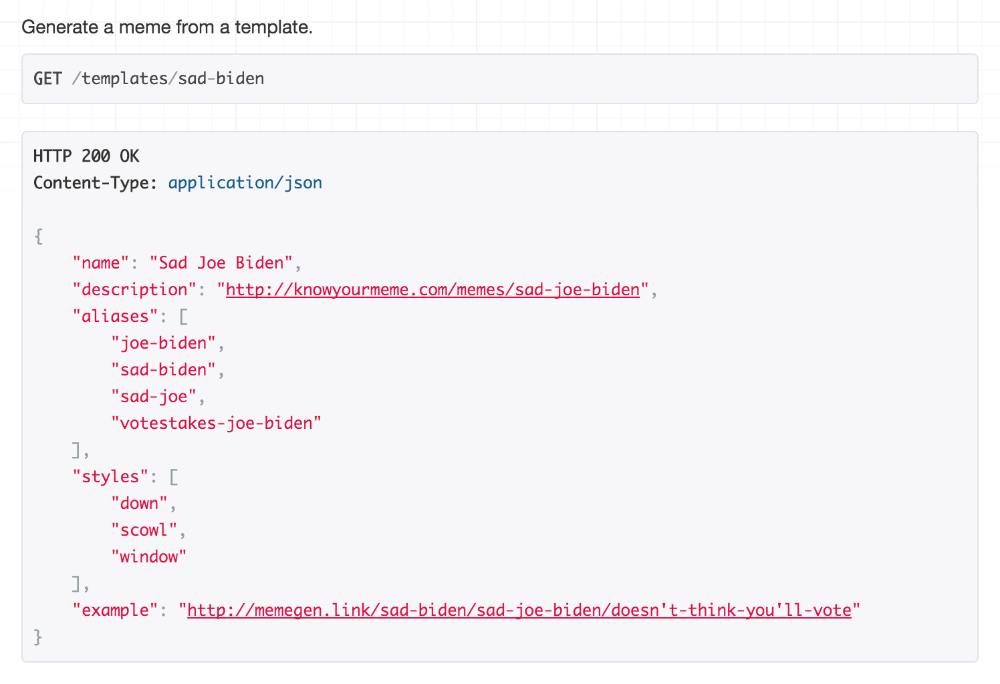

# MemeGen

An API to generate meme images based solely on requested URLs.

Unix: 
Windows:  Metrics: 

## Generating Images

Visit [http://memegen.link/api](http://memegen.link/api) to browse the API and view examples.

MemeGen URLs contain all the information necessary to generate the image. For example, http://memegen.link/buzz/memes/memes-everywhere.jpg produces:

But, the site can also produce masked URLs to conceal the joke:

http://memegen.link/_YnV6egltZW1lcy9tZW1lcy1ldmVyeXdoZXJl.jpg

For any MemeGen image, lose the extension to see a list of all format options:

http://memegen.link/buzz/memes/memes-everywhere

### Special Characters

In URLs, spaces can be inserted using dashes or underscores:

* dash (`-`) → space (` `)
* underscore (`_`) → space (` `)
* 2 dashes (`--`) → dash (`-`)
* 2 underscores (`__`) → underscore (`_`)

Reserved URL characters can be escaped:

* tilde + Q (`~q`) → question mark (`?`)
* tilde + P (`~p`) → percentage (`%`)
* 2 single qutoes (`''`) → double quote (`"`)

For example: [http://memegen.link/doge/special-characters~q/underscore__-dash--.jpg](http://memegen.link/doge/special-characters~q/underscore__-dash--.jpg)

### Alternate Styles

Some memes come in multiple forms, which can be selected via `?alt=<style>`:

For example: [http://memegen.link/sad-biden/sad-joe-biden/doesn't-think-you'll-vote.jpg?alt=scowl](http://memegen.link/sad-biden/sad-joe-biden/doesn't-think-you'll-vote.jpg?alt=scowl)

Or, you can use your own image URL as the style. For example, http://memegen.link/custom/my-pretty/background.jpg?alt=http://www.gstatic.com/webp/gallery/1.jpg produces:

## Adding Templates

To add a new template, please follow the [contributor instructions](CONTRIBUTING.md).

Thanks go to [danieldiekmeier/memegenerator](https://github.com/danieldiekmeier/memegenerator) for the inspiration!

## Slack Integration

Check out one of these options:

* [nicolewhite/slack-meme](https://github.com/nicolewhite/slack-meme)
* [CptSpaceToaster/slackbot](https://github.com/CptSpaceToaster/slackbot)
* http://www.memetizer.com
